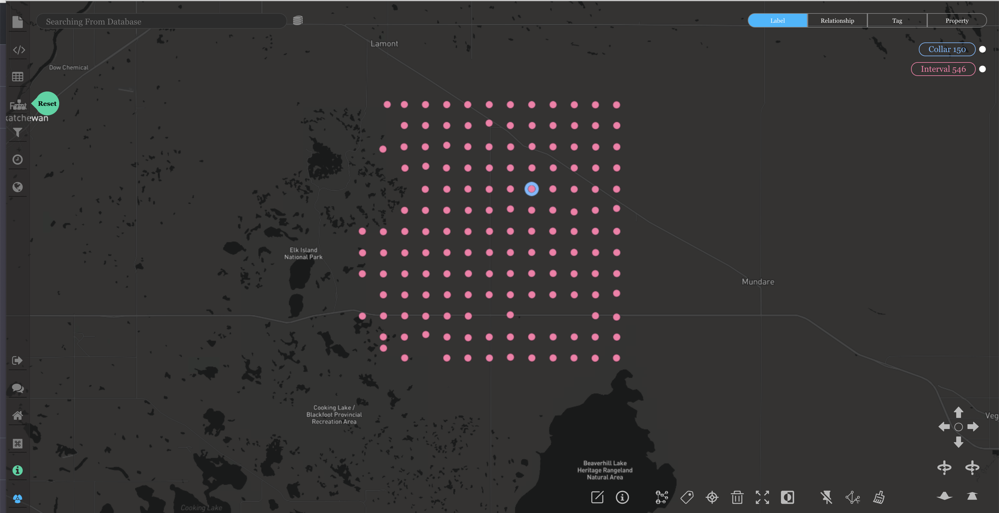
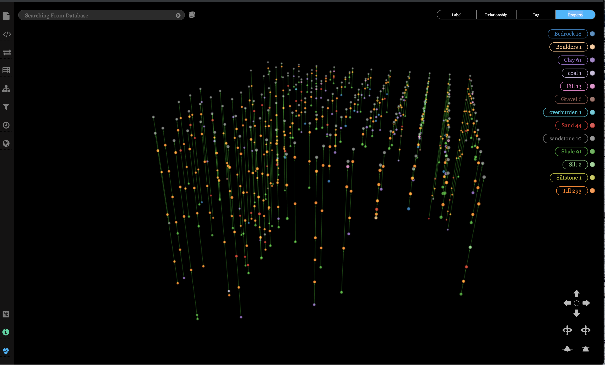
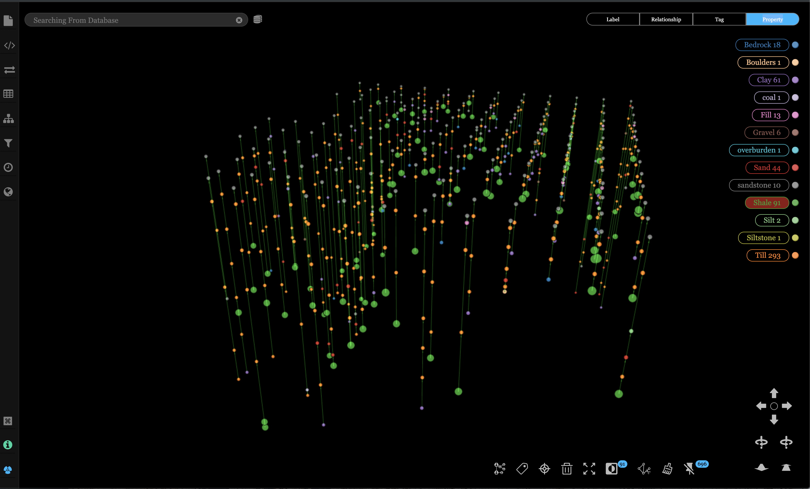
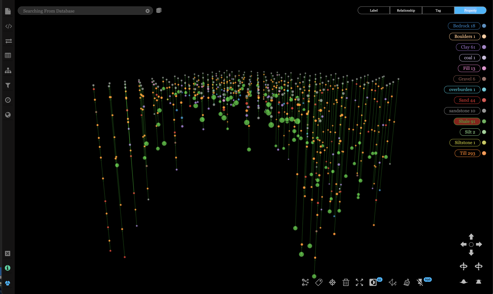

# Borehole Experiment

In this experiment, we are going underground to try neo4j spatial out with modelling a set of boreholes. 

## Borehole uses and types

There are many different kinds of borehole logs:

- Groundwater boreholes and Water well logs: holes that are drilled to test and characterize aquifers
- Dimond Drill holes typically used to characterize hard rock minerals for the purpose of hard rock mining
- Well Logs for the purpose of petroleum exploration and produciton 

All of these have the same basic structure: 

- A surface location or collar is chosen, an underground target is chosen typically using geophysics or geochemiscal interpretations
- A drill is setup on this location - the type of drill will depend on the depth, type of hole being drilled and purpose for the hole
- The drilling process usually involves taking some form of core or sample at intervals down the hole
- Additional tests are frequently done to characterize the material in the hole
- These data are turned into logs that are then used to build an interpretation of the geological layers that exist subsurface.

The interesting thing from a graph database perspective is that these logs all are surface location points that then have linked lists of data at distances from this surface location. Traditionally these can be very challenging to model using relational databases because they have often fairly fluid, flexible data structures. 

While this is a simplificaiton of the actual process which is very involved and uses massive amounts of data, generally the interpretation process seeks to connect inervals from individual boreholes together by looking for similar defining characteristics of the layers found in the interval data. 

## Experiment: Model a set of lithological borehole interpretations using Neo4j

Borehole data seems to be a bit harder to find on the open data front. I did find a set that looks reasonable here:

[Data Source:](https://open.alberta.ca/opendata/41d27d78-3268-48ab-9c38-34f87dd1b35a#summary)

These data are from a set of borehole lithology logs. Lithology logs are drilled typically to get a sense of the type of material in the subsurface of a given area. These are drilled in soil to characterize material for purposes of identifying contaminants, looking for useful materials such as gravel, identifying aquifers etc. 


### Spatial References

The Boreholes.txt file uses NAD83. Currently Neo4j spatial only supports WGS84 - 'standard' lat/long. THis means we have to convert the borehole file from NAD83 to WGS84 as Neo4j does not currently support other spatial reference datums, nor does it support conversion between datums. Fortunately, there are a myriad of geospatial tools available to do this. Even better news: we can use open source tools to do this rather than needing ESRI, which is expensive. 

QGIS is the best open source alternative to ESRI, and it can be freely downloaded from: [Quantum GIS](https://qgis.org/en/site/)

I have included the converted the file in /datasources, but if you want to work through the process, it involves bringing the Boreholes.csv file into Quantum GIS, setting the NAD83 reference, and projecting the collars to WGS84 using QGIS tools. 

## Importing Borehole Data

The process of importing the borehole data will involve bringing in the collar locations first, geotagging them with the lat/long/eleveation point as part of that process and setting up the borehole metadata. The code for this is in 1_import_boreholes.cql. 

The intervals will be brought in next. Because the intervals are in a CSV table and may not be in order, the first pass will link the
intervals to the collars in a cluster format: i.e. direct relationship between the collar and the interval. The code for this is in 2_import_intervals.cql. 


### Data Import Process

I have included a fully populated Zipped version of the resulting database, but if you want to work through the import and post-processing, perform the following: 

- Run the 1_import_boreholes.cql - this imports the borehole collar locations, and sets them up with the lat/long/elevation
- Run the 2_import_intervals.cql - this will bring the intervals in as a cluster of nodes around the collar. 

If you are using a newer version of Neo4j, you can turn on the multiple-statement swich in the neo4j browser, and copy/paste the import CQL files contents in. 

You can also use a terminal or command shell to paste in the following command to process the files in this manner:
```
docker exec borehole bin/neo4j-shell -file /scripts/<name of the script from the "scripts" directory here>
```


### Processing Intervals into Borehole Structure

The next step then once the boreholes are imported will be to run a CQL command that transforms the cluster into linked lists of intervals based on their depth down hole, and remove the original relationship. 

Fortunately, our good friend Mark Needham has already beaten us to a nice procedure that does this using Unwind in this [blog post](https://markhneedham.com/blog/2015/06/04/neo4j-cypher-step-by-step-to-creating-a-linked-list-of-adjacent-nodes-using-unwind/):

```
// Process Intervals Into Linked List
MATCH (c:Collar)-[]-(i:Interval) 
with c, i order by i.FromDepth
with c, collect(i) as intervals 
with c,intervals,intervals[0] as first
merge (c)-[:NEXT_INTERVAL]->(first)
with c,intervals
unwind RANGE(0,LENGTH(intervals)-2 ) as idx
WITH intervals[idx] AS s1, intervals[idx+1] AS s2
MERGE (s1)-[:NEXT_INTERVAL]->(s2)

// Remove original collar->interval relationship 
match (c:Collar)-[r:HAS_INTERVAL]->(i:Interval)
delete r

```

### Interval Length Mapping: 

Once we have the intervals into a linked list, we need to map the lengths between intervals onto the relationship between the intervals, remembering to also do this for the first relationship (we could likely do these all as one statement):

```

// Process lenth of interval onto edge
MATCH (c:Collar)-[:NEXT_INTERVAL*]-(i:Interval) 
with c, i order by i.FromDepth
with c, collect(i) as intervals 
with c,intervals
with c,intervals,intervals[0] as first
MATCH (first)-[r:NEXT_INTERVAL]->(second) set r.Length=second.ToDepth-first.ToDepth
with c,intervals
unwind RANGE(0,LENGTH(intervals)-2 ) as idx
WITH intervals[idx] AS s1, intervals[idx+1] AS s2
MATCH (s1)-[r:NEXT_INTERVAL]->(s2) set r.Length=s2.ToDepth-s1.ToDepth

```

### Compute downhole interval point location

We will compute a downhole x,y,z coordinate for each interval. This should allow us to plot the borehole collars and intervals on a map, and visualize them using either a point cloud or borehole mapping utility. 

Boreholes are not all straight. Depending on the type of drilling, nature of the material being drilled into, and depth of drilling, boreholes will naturally tend to deflect. Oil and gas
drilling takes advantage of this fact by using advanced techology to actually direct the drill bit towards a target. This was part of the innovation that enabled fracking to become a powerful method for oil and gas extraction. 

In the case of the borehole set we are working with for this demonstration which were drilled for lithology classification, the holes are fairly shallow and thus were not surveyed. We can therefore assume they are vertical, so the point calculations for the intervals are simply subtracting the depth of the interval from the collar elevation and using the same lat/long as the collar.  

```

// Calculate X,Y,Z point for intervals
match (c:Collar {Name:'141'})-[r:NEXT_INTERVAL*]-(i:Interval)
with c, i order by i.FromDepth
with c, collect(i) as intervals 
with c,intervals
unwind intervals as interval
with c,interval,c.El_DR_masl-interval.FromDepth as depth
set interval.location=point({x: c.Lat_NAD83, y: c.Long_NAD83,z:depth, crs:'WGS-84-3D'})
return c,interval

```

We should end up with linked lists of boreholes of boreholes:


### Generate A Simplified Layer Interpretation

Geologists will go through a process to interpret the intervals on the boreholes into geological layers. These layers are a representation based on sparse data from the borehole intervals of what conceptually is below the surface. 

Depending on the use of the geological data interpretations will vary in terms of level of detail. If the geologist is attempting to identify material for use for fill for a roadbed, understanding the soil stability or load capacity for a structure, or attempting to locate potential aquifers for a water source, the resulting interpretation may be very detailed.

If the intent is to have a general characterization of a region, the layers may be less granular. 

To keep things simple therefore for the purposes of this demonstration, we will create a new property called 'Layer' that will reduce the number of logged types down from >20 to 12:

```

MATCH (i:Interval) where i.Pri_Material <> '?' and i.Pri_Material <> 'no data' and i.Pri_Material <> 'not indicated' and i.Pri_Material <> 'no recovery' and i.Pri_Material <> 'no sample'
with i,
case
when lower(i.Pri_Material) contains('clay') or lower(i.Pri_Material) contains('bentonite') then 'Clay'
when lower(i.Pri_Material) contains('boulder')  then 'Boulders'
when lower(i.Pri_Material) contains ('till') then 'Till'
when lower(i.Pri_Material) ends with ('sand') then 'Sand'
when lower(i.Pri_Material) ends with ('shale') then 'Shale'
when lower(i.Pri_Material) contains ('gravel') then 'Gravel'
when lower(i.Pri_Material) ends with ('mudstone') then 'Mudstone'
when lower(i.Pri_Material) contains ('bedrock') then 'Bedrock'
when lower(i.Pri_Material) ends with ('fill') then 'Fill'
when lower(i.Pri_Material) ends with ('silt') then 'Silt'
when lower(i.Pri_Material) ends with ('siltstone') then 'Siltstone'
when lower(i.Pri_Material) ends with ('pebbles') then 'Pebbles'
when lower(i.Pri_Material) contains('rocks') or lower(i.Pri_Material) contains('stones') then 'Rocks'
else i.Pri_Material
 
end as layer
set i.Layer = layer
```


## Visualizing the Borehole Data

There are a large number of ways to visulize borehole data, although due to the specific domain associted with borehole data, these typically rely powerful geological interpretation software such as Lepfrog. 

For the purposes of this demo, which are to illustrate how the structure of the data and the data itself may be fully represented in a single database in which the graph ARE the boreholes, 


## Visualizing Using Kineviz GraphXR

Kineviz develops visual analytics software and solutions. Kineviz has developed GraphXR platform offers unprecedented speed, power, and ease of use for deriving insight from sources such as geospatial, time series, rich documents, financial transactions, and social media data. (see more about Kineviz and GraphXR below)

https://www.kineviz.com/graphxr


We can use the following query in GraphXR to pull back boreholes (exlude holes where we don't have logged material):

```

MATCH (c:Collar)-[:NEXT_INTERVAL*]-(i:Interval) where i.Pri_Material <> '?' and i.Pri_Material <> 'no data' and i.Pri_Material <> 'not indicated' return c,i

```

We start by locating the boreholes on a 2d map:



Move this into a 3d view for interpretation:



Using GraphXR Project settings, set the view to display the Layer property we created:



Now select the Shale layer and rotate the model to get a sense of where the shale resides:




Kineviz has kindly provided a rendered view ready to go in GraphXR:

https://graphxr.kineviz.com/share/5cd36d001eb32e0067057519/Borehole/5cd36db11eb32e006705751c


## Next Steps: Analyze and Correlate the Borehole Data

The geologist would typically start to work up an interpretation of the borehole data by linking the layers together into geological cross sections. More modern tools such as Leapfrog can automatically generate complex 3d models from borehole data. 

Most of these tools though keep the geology and the elements and decisions that went into the model seperate if they retain them at all. My sense is that due to the fact that data in Neo4j IS the model, it should be possible to handle the modelling and retain all the associated data in the same graph. 

I'll be exploring this in future posts. 

If you have any questions, please reach out to me via Linked in, or on the neo4j community. 

Cheers!
Mike M. 


## About The Contributors:

A big thanks to the Kineviz team for helping bring this example to life!

### More details on Kineviz GraphXR:

Kineviz develops visual analytics software and solutions. Kineviz's GraphXR platform offers unprecedented speed, power, and ease of use for deriving insight from sources such as geospatial, time series, rich documents, financial transactions, and social media data. For technical users, it's a highly flexible and extensible environment for conducting ad hoc analysis. For business users, it's a start-to-finish tool for intuitive, code-free investigation.

Collect data from Relational and Graph databases, CSVs, and Json. 
Cleanse and enrich with built-in tools as well as API calls. 
Analyze links, properties, time series, and spatial data within a unified, animated context. 

Save back to Neo4j, output as a report, or embed in your webpage. 
GraphXR supports a wide range of applications including law enforcement, medical research, and knowledge management.  

[Kineviz GraphXR](https://www.kineviz.com/graphxr)

### More details on Menome Technologies:

Menome Technologies Inc -> Imagine What You Could Know….

Menome Technologies has invented breakthrough data refinement, data management, and AI-based analytical solutions to provide data-driven organizations with unprecedented visibility and contextual understanding of their corporation’s entire set of knowledge assets.  

Information that was previously inaccessible – historic information, reports, PDFs, presentations, and articles – can be seamlessly integrated with all other corporate information for more accurate decision-making.

At mining, energy, and environmental companies, Menome integrates field telemetry, environmental assessments, historical reports, risk assessments, and project data.

Using these Menome powerful proprietary machine-based-learning tools to identify hidden data structures and identify and uncover trends, to provide the richest and most accurate understanding of the impacts of key decision alternatives. 

Decisions based on holistic data knowledges are more likely to drive productivity, reduce risk, and generation profits. 

[Menome Technologies Inc.](https://www.menome.com)

