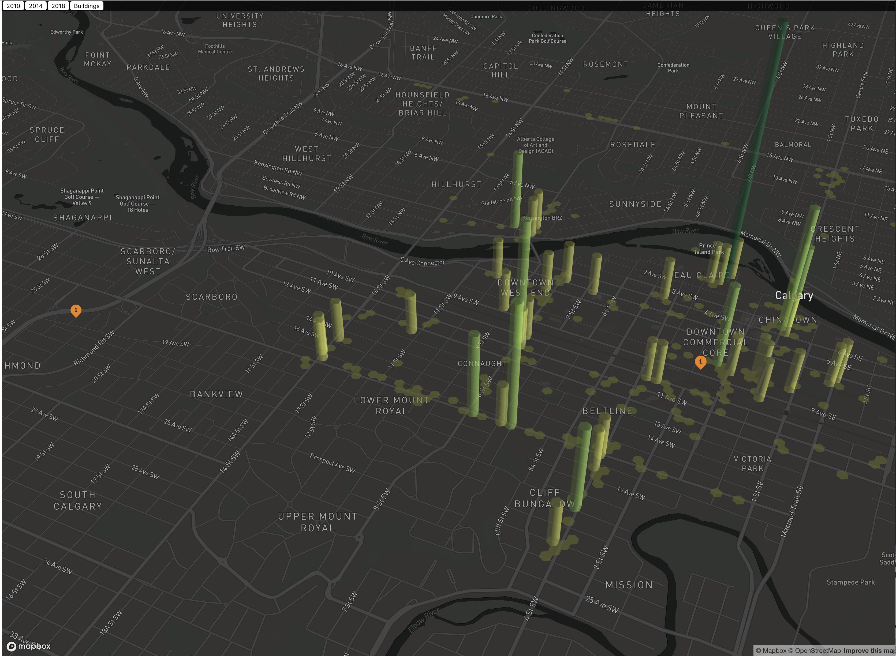

# Menome Technologies Presents Spatial Experiments with Neo4j!

Greetings! I have a long career in working with spatial data. This covers the range of standard GIS (ESRI and Geoserver, 3d modelling for mining operations, complex geological modelling, buildings and structures, finite element and numerical analysis. 

So it was incredibly exciting when Neo4j introduced spatial capabilities. While these are currently limited compared to what something like ESRI offers in terms of standard GIS analyisis such as buffering etc., the fact that neo4j supports both 3d spatial and 3d cartesian coordinates opens up a whole realm of possiblities that will ultimately trancend what a typical GIS can do.

This is because neo4j due to its graph model of nodes and relationships when combined with veing able to assign 3d sptaial and cartsian coordinates to nodes becomes both a GIS and what runs behind most CAD and numerical models. Standard CAD and GIS sytems use tabular data structures that are converted to graph structures in memory to do their work. Generally the data aspect and the structural/spatial/3d aspects are stored in seperate table structures. Autocad and Revit actually use completely seperate data and structural data stores to model buildings and other complex 3d objects.

Neo4j with its spatial capabilties now makes it possible to actually fully combine the 3d struture, spatial structure and data into a single model. It also being a graph database then has all the power that affords, plus the text analytics, lucene full text engine and AI/ML libraries. This suddently means that not only does it become possible to model spatial surface models such as Open Street Maps, but the buildings on those maps, the boreholes and subsurface data that make up geological or geotechnical data, and all of the reports, design documents and other structured and unstructured data that are associated with any complex engineering strucutre.

This has the potential to be incredibly powerful and very disruptive to the world of engineering and geology. 

My goal with these spatial experimentes is to explore using small,focused mini-projects the range of possiblities to validate how far I can take the spatial capabilities of neo4j.

## Experiement 1 - Walkscore computation using Neo4j

The first experiement was to take Open Street Map data and see if I could construct a basic spatial analysis using Neo4j. For this experiement I chose to pursue replicating the Walk Score algortihm. I did this because it is a well known, published algorithm that I could validate my work against. 

The Walk Score example is documented and stored in 1_walkscore directory. A further experiement will seek to imporve and replace the base Walk Score algorithm using Graph Techniques for calculating actual distance instead of linear distance to assess features, and will combine the Yelp ratings scores data to factor in amenity quality as part of the rank. 

[Read about Walkscore Here](./1_walkscore/readme.md)

## Experiement 2 - Subsurface data - Modelling boreholes with Neo4j

Coming Soon!
